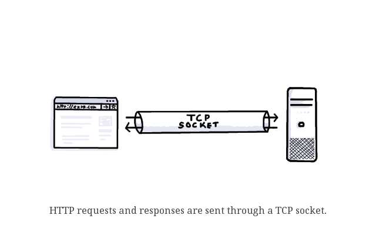
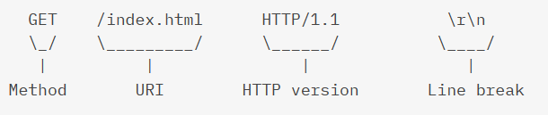

# HTTPServer

## Overview

HTTPServer is a simple implementation of an HTTP server in Python, designed for educational purposes. This server is capable of handling basic HTTP GET requests, serving static files, and responding to different HTTP status codes. The server is implemented using the socket library in Python.

## How it Works

### 1.  TCPServer Class

<p align="center">
  
</p>


The `TCPServer` class serves as a generic TCP server and provides a foundation for the HTTP server. It initializes a socket, binds it to a specified host and port, and listens for incoming connections. The `start` method of `TCPServer` listens for incoming connections and, upon connection, handles the request using the `handle_request` method.

### 2.  HTTPServer Class

<p align="center">
  
</p>

The `HTTPServer` class is a subclass of `TCPServer` and is specifically tailored for handling HTTP requests. It overrides the `handle_request` method to determine the appropriate action based on the request method (GET, POST, etc.). The server supports basic HTTP status codes (200, 404, 403, 501) and has corresponding handlers for each.

### 3 . HTTPRequest Class

<p align="center">
  
</p>

The `HTTPRequest` class is responsible for parsing incoming HTTP requests. It extracts information such as the request method, URI, and HTTP version from the raw request data.

### 4.  Handling GET Requests

<p align="center">
  
</p>

The server includes a handler for GET requests (`handle_GET`). It processes the requested file, checks its existence, determines the MIME type, and sends an appropriate response.

###  5. Handling Status Codes

The server includes handlers for specific status codes, such as 404 (Not Found), 403 (Access Forbidden), and 501 (Not Implemented). These handlers generate corresponding response pages.

## Code Explanation

The code is well-organized and follows a modular structure:

- **TCPServer:** Generic TCP server for handling connections.
- **HTTPServer:** Specific implementation for handling HTTP requests, extending the TCPServer class.
- **HTTPRequest:** Parses incoming HTTP requests and extracts relevant information.

The server responses include HTTP headers such as "Server" and "Content-Type" along with the appropriate status code and response body.

## How to Use

To use the HTTP server, simply create an instance of the `HTTPServer` class and call the `start` method. By default, the server listens on `127.0.0.1:8888`.

```python
if __name__ == '__main__':
    server = HTTPServer()
    server.start()
